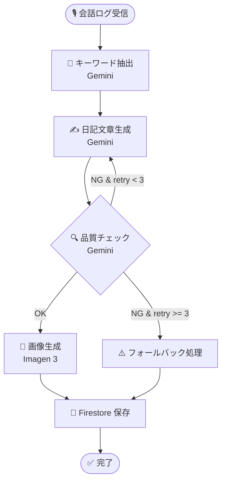

# 🎨 デザイン & 実装設計

## 1. コンセプト: 日報アシスタント

### 課題感
- 日報を夕方に書くのが辛い（疲れ、家族の用事など）
- めんどくさくてスキップしてしまう
- 「同居人に晩御飯を聞かれて思考停止する」ような状況を救いたい

### ソリューション
- **音声インタビュー形式のエージェント**
- 数語話すだけで、AIが文脈や予定を加味して絵日記・日報を作成
- "ぼくの夏休み" 風の絵日記ジェネレーター

### スコープ
1. **入力**: 音声で今日の出来事を話す（4単語程度でもOK）
2. **変換**: AIがテキスト化し、絵日記風の文章に変換
3. **描画**: 文章を元に画像を生成
4. **出力**: 絵日記画像とテキストを日付とともに保存


---

## 2. システム構成

### 全体構成図
- **Frontend**: SvelteKit @ Firebase App Hosting
- **Backend**: Python / FastAPI @ Cloud Run
- **DB/Storage**: Firestore, Cloud Storage
- **AI**: Gemini Pro 2.0 (Vertex AI), Gemini 2.5 Flash Image (画像生成)

### 各コンポーネントの役割

#### 🖥️ フロントエンド (SvelteKit)
- **役割**:
    - ユーザーインターフェース（録音、閲覧）
    - **Vertex AI Multimodal Live API への直接接続** (WebRTC/WebSocket)
    - 過去の日記閲覧（リスト/カレンダー表示）
- **ホスティング**: Firebase App Hosting

#### ⚙️ バックエンド (Cloud Run / FastAPI)
- **役割**:
    1.  **Auth (認証)**: FrontendがGeminiと通信するための「短期トークン」発行
    2.  **Summary (後処理)**: 会話ログを受け取り、構造化データ（JSON）にして保存
    3.  **Job**: Imagen 3 での画像生成トリガー
- **技術**: Python, FastAPI

#### 💾 ストレージ & データベース
- **Cloud Firestore**:
    - 日記データ（日付、本文、画像URL、メタデータ）
    - フロントエンドへのリアルタイム反映（NoSQLドキュメント指向）
- **Cloud Storage**:
    - 生成された絵日記画像の保存

---

## 3. 実装詳細: 音声対話フロー

### アーキテクチャのポイント
**「フロントエンドから Gemini (Vertex AI) へ直接つなぐ」** 構成を採用します。

> 🚫 **バックエンドを中継しない理由**
> * **遅延回避**: Server-side WebRTC中継によるラグを防ぐ
> * **複雑性回避**: 音声ストリーム管理のコスト削減

### 処理フロー
1.  **トークン取得**:
    *   Client -> Backend: 接続リクエスト
    *   Backend -> Client: Vertex AI アクセストークン発行
2.  **対話 (Real-time)**:
    *   Client <-> Vertex AI: WebRTC/WebSocketで音声対話
    *   マイク入力 -> Gemini
    *   Gemini音声 -> スピーカー
3.  **保存 (Post-process)**:
    *   会話終了後、Client -> Backend: 会話ログ送信
    *   Backend: 要約生成 -> 画像生成 -> Firestore保存

---

## 4. 開発分担 & 環境

### 担当領域
* **フロントエンド担当**:
    * マイク入力の UI と音声波形の表示。
    * Vertex AI SDK を使ったリアルタイム通信の実装。
    * Firestore から日記データを読み込んで表示する画面。
    * 会話して、インタビューさせて絵日記文章の材料を生成させて、バックエンドにポストする

* **バックエンド（Cloud Run）担当**:
    * Gemini 用のトークン発行エンドポイントの作成。
    * 会話終了後に「4単語を抽出 → 日記作成 → 画像生成」を行う非同期ジョブの実装。
    * Firestore のデータ更新
    * Discord や Slack への通知連携。


### ローカル開発 (Docker Compose)
*   ローカルエミュレータを使用する場合でも、**Vertex AI はクラウド上の実リソース**を使用します。
*   Google Cloud 認証（ADC）とトークン発行が正しく機能するかがセットアップの鍵です。

---

## 5. 絵日記生成ワークフロー (LangGraph)

会話ログから絵日記を生成する処理を、**LangGraph** を使ったグラフベースのワークフローとして実装します。
これにより、処理の流れが明確になり、品質チェック→再生成のループ（Agentic な自己改善）も表現できます。

### ワークフロー図



### 各ノードの役割

| ノード | 処理内容 | 使用API |
|--------|----------|---------|
| `extract` | 会話ログから4つのキーワードを抽出 | Gemini Pro |
| `generate` | キーワードを元に「ぼくの夏休み」風の日記テキスト生成 | Gemini Pro |
| `check` | 生成された文章の品質評価（子供らしさ、絵日記らしさ） | Gemini Pro |
| `image` | 日記テキストを元に絵日記風の画像を生成 | Gemini 2.5 Flash Image |
| `save` | 結果を Firestore に保存、ステータスを `completed` に更新 | Firestore |

### 状態管理 (State)

```python
class DiaryState(TypedDict):
    document_id: str          # Firestore ドキュメント ID
    conversation_log: dict    # 入力: 会話ログ（report_diary_event の引数）
    keywords: list[str]       # 抽出されたキーワード
    diary_text: str           # 生成された日記テキスト
    quality_score: float      # 品質スコア (0.0 - 1.0)
    retry_count: int          # リトライ回数
    image_url: str            # 生成された画像の URL
    status: str               # pending / processing / completed / failed
```

### Agentic ポイント

1. **自己評価ループ**: 生成結果を別の Gemini 呼び出しで評価し、基準を満たさなければ再生成
2. **条件分岐**: 品質スコアに応じて次のアクションを決定（OK → 画像生成 / NG → リトライ）
3. **フォールバック**: リトライ上限に達した場合も graceful に終了
