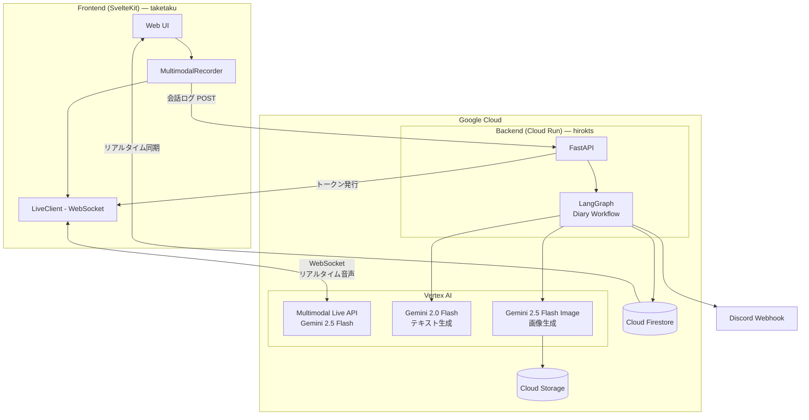
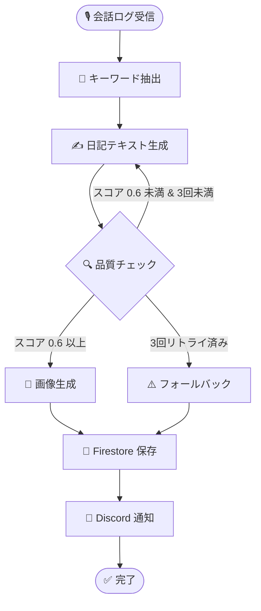

## チェックアウトをスキップする日々

Obsidian に「夕方のチェックアウト」というタイムボックスを用意している。1日の終わりに15分、今日やったことを振り返って書き出す時間。

毎日スキップしている。

やったことは覚えている。会議に出た、コードを書いた、猫が膝に乗ってきた。問題は、それを文章として打ち込む気力が夕方には残っていないということだ。Obsidian のデイリーノートには「## チェックアウト」の見出しだけが並んでいる。中身は空。

もうひとつ気づいたことがある。たまに日報を書いたとしても、テキストだけだと後から読み返しても記憶が蘇らない。「MTGに参加した」「PRをレビューした」。事実の羅列は日記ではなく、ただのログだ。

じゃあ、チェックアウトをテキストの記録ではなく **「今日のイメージ写真」の作成** にしたらどうだろう。1日を1枚の絵にして残す。文字では思い出せなくても、絵を見れば「ああ、あの日か」と蘇る。そういう日報のかたちがあってもいい。

ここから **Enikki（絵日記）** が始まった。


*話すだけで「ぼくの夏休み」風の絵日記が完成する*

:::message
本記事は [第4回 Agentic AI Hackathon with Google Cloud](https://zenn.dev/hackathons/google-cloud-japan-ai-hackathon-vol4) への参加作品として開発したものです。
:::

## デモ

@[youtube](YOUR_YOUTUBE_ID)

## Enikki の仕組み

キックオフで議論した結果、こういうシステムを作ることにした。

- **フェーズ1**: AIが音声で「今日どうだった？」とインタビューし、絵日記の材料を集める。十分な情報が集まったらAI自身の判断で会話を切り上げる
- **フェーズ2**: 集まった材料から「ぼくの夏休み」風の文章と絵を自動生成する。生成した文章はAI自身が品質チェックし、基準未満なら再生成する

「ぼくの夏休み」風にしたのは、日報が堅苦しいから続かないのであって、クスッと笑える絵日記なら毎日見返したくなるかもしれないと思ったからだ。

> 今日は会議がなかった。さいこうの一日だった。

こういう1行が残るなら、チェックアウトも悪くない。

---

## アーキテクチャ



| レイヤー | 技術 | 選定理由 |
|----------|------|----------|
| **Frontend** | SvelteKit | Next.js はオーバースペックに感じたため、軽量なフレームワークを選択 |
| **Backend** | FastAPI + LangGraph | Python でワークフローを宣言的に書ける |
| **音声対話** | Gemini 2.5 Flash (Multimodal Live API) | 音声でGeminiとリアルタイムに会話できるAPI。ブラウザからWebSocketで直接接続でき、レイテンシが小さい |
| **テキスト生成** | Gemini 2.0 Flash | 日記生成＋品質チェックの2段階で使用 |
| **画像生成** | Gemini 2.5 Flash Image | Imagen 3 より自然言語指定での画像生成が高精度 |
| **DB** | Cloud Firestore | リアルタイムリスナー機能があり、WebSocket サーバーを別途用意せずにステータス変更を即座にフロントへ通知できる |
| **Hosting** | Firebase Hosting + Cloud Run | フロント/バックエンドで分離デプロイ |

大きく **2つのフェーズ** に分かれる。フロントエンドがGeminiと直接音声対話する「インタビュー」フェーズと、バックエンドのLangGraphで絵日記を生成する「ワークフロー」フェーズ。

### 担当

- バックエンド: hirokts
- フロントエンド: taketaku

---

## フェーズ1: AIインタビュー — 音声でGeminiと直接つなぐ

### 設計判断: バックエンドを中継しない

音声対話の実装で最初に決めなければならなかったのは、音声データの経路。

**案A: バックエンド中継型**
```
ブラウザ → Cloud Run → Gemini → Cloud Run → ブラウザ
```

**案B: フロントエンド直結型**
```
ブラウザ → Gemini Live API
```

案Bのほうが自然な音声対話を実現できる可能性が高いと判断した。

**案Bを採用した。** バックエンドの役割は2つだけに絞った。

1. **トークン発行**: フロントエンドが Gemini に接続するための短期アクセストークンを生成
2. **後処理**: 会話終了後に会話ログを受け取り、絵日記生成ワークフローを実行

```python
# バックエンド: トークン発行（セキュリティの要）
@app.post("/auth/token")
def get_auth_token():
    credentials, project = google.auth.default(
        scopes=["https://www.googleapis.com/auth/cloud-platform"]
    )
    credentials.refresh(google.auth.transport.requests.Request())
    return TokenResponse(accessToken=credentials.token, expiresIn=3600)
```

API Key をフロントエンドに埋め込まないため、セキュリティも確保される。

### Agentic な振る舞い: AI が会話を自律的に終了する

Tool Callingを使って、会話の終了タイミングをAIに委ねている。セットアップメッセージで `report_diary_event` というツールを定義しておく。

```typescript
tools: [{
  function_declarations: [{
    name: 'report_diary_event',
    description: '絵日記に必要な情報が集まったら呼び出す',
    parameters: {
      type: 'OBJECT',
      properties: {
        activity: { type: 'STRING' },
        feeling:  { type: 'STRING' },
        summary:  { type: 'STRING' },
        joke_hint: { type: 'STRING', description: '大人向けジョークのヒント' }
      }
    }
  }]
}]
```

Gemini が「情報は十分集まった」と判断すると、自分でこの関数を呼ぶ。ユーザーが「終了」ボタンを押すのではなく、**AI が自律的に会話を切り上げる。** フロントエンドは `report_diary_event` の呼び出しを検知すると会話を終了し、それまでの会話ログをバックエンドに POST する。

初めて音声チャットで Gemini が応答した瞬間、2人とも画面の前で声を上げた。「え、本当にブラウザから直接話せるの？」。ドキュメントで読んだ仕組みが目の前で動くのは、理解とは別の驚きがある。

---

## フェーズ2: 絵日記を生成する — LangGraph ワークフロー

バックエンドが会話ログを受け取ると、LangGraph のワークフローが起動する。

### なぜ LangGraph か

最初は Gemini API を順番に呼ぶだけのスクリプトを書いた。キーワード抽出 → テキスト生成 → 画像生成。動いたが、テキストの品質にムラがあった。品質チェックと再試行のループを足したくなった。

正直なところ、今回の品質チェックループくらいなら if 文と while ループでも書ける。それでも LangGraph を選んだのは、将来的に **Human-in-the-Loop**（ユーザーが生成結果を確認してから画像生成に進む）や **チェックポインティング**（途中で中断しても再開できる）を入れたくなったとき、LangGraph のグラフ構造なら拡張しやすいから。今回はそこまで実装していないが、土台は作っておきたかった。



### 各ノードの詳細

まず会話ログから「絵に描きやすい」4つのキーワードを抽出する。

そこからテキストを生成する。プロンプトで「ぼくの夏休み」風の文体ルールを指定している。

```
- 100〜150文字程度
- 子供らしい素直な文体
- 「今日は〜」で始める
- 五感の描写を1つ入れる
- 末尾に大人向けのクスッとくるジョークを添える
```

ジョークのパターンもプロンプトで具体的に示している。

```
### 括弧でツッコミ（現実を添える）
- 「早起きした（9時）」
- 「たくさん歩いた（5000歩）」

### 大人の悩みを子供言葉で
- 「有給がもっとほしい」
- 「カロリーのことは考えないことにした」
```

生成されたテキストは、**別の Gemini 呼び出し** で品質チェックにかける。「子供らしい文体か」「感情表現があるか」などの基準を渡し、0.0〜1.0 の総合スコアを JSON で返させている。スコアが 0.6 以上なら合格、未満なら再生成。3回リトライしてもダメならフォールバック。完璧を求めて無限ループに入るよりは、そこそこの品質で先に進むほうが実用的だ。

品質チェックの後は、画像生成と Discord への完了通知が続く。画像生成は当初 Imagen 3 を使っていたが、自然言語での指示に対する精度が高い Gemini 2.5 Flash Image に乗り換えた。日本語キーワードは一度英語に翻訳してから渡している。Discord 通知は Webhook で POST するだけだが、チーム2人で開発していると相手の生成テストも通知が飛んでくるので、お互いの進捗が自然に見えた。

---

## UX の工夫: 待ち時間をストレスにしない

テキスト生成 → 品質チェック（最大3回）→ 画像生成というパイプラインは数十秒かかる。API を同期的に待たせるとタイムアウトする。

**FastAPI の `BackgroundTasks` でバックグラウンド実行し、API は即座に `pending` を返す。** バックエンドは生成完了時に Firestore のドキュメントのステータスを `completed` に更新する。フロントエンドは Firestore のリアルタイムリスナー（`onSnapshot`）でこの変更を即座に検知し、絵日記を表示する。WebSocket サーバーを自前で立てなくても、Firestore を用意するだけでリアルタイム通知が手に入る。

```typescript
onSnapshot(doc(db, 'diaries', diaryId), (snapshot) => {
  const data = snapshot.data();
  diaryStatus = data.status;  // pending → processing → completed

  if (data.status === 'completed') {
    generatedDiary = { imageSrc: data.imageUrl, text: data.diaryText };
  }
});
```

ユーザーから見ると「絵を描いています…」の画面の後、絵日記がそのまま表示される。リロードは不要。

---

## 開発プロセスの工夫: Antigravity(コーディングエージェント) と「軽い」課題管理

このプロジェクトの実装は、ほぼすべて [Antigravity](https://antigravity.google/)（Google 製の AI コーディングエージェントエディタ）に任せている。自分たちが書いたのは設計判断とプロンプトの調整くらいで、コードの大半はAIが書いた。FastAPI のエンドポイント定義、LangGraph のワークフロー構築、SvelteKit のコンポーネント実装。「こういう機能がほしい」を伝えると、Antigravity がコードを書き、テストしてくれる。

ここで1つ試したかったことがある。**課題管理ツールを Linear や Notion にせず、Git リポジトリ内の Markdown ファイルで行う** というアプローチだ。

### 仮説: 外部ツールの MCP は「重い」

普段の開発では Linear を使っているが、MCP 経由でデータを取得すると気になる点がある。課題を読み込むかどうかはAIの判断に委ねられており、読み込んだときのネットワーク IO とコンテキスト消費が地味に重い。[MCPのツールが増えるほどコンテキストが肥大化する問題](https://azukiazusa.dev/blog/model-context-protocol-tool-sprawl/)の記事でも指摘されている通り、外部ツール連携にはオーバーヘッドがある。

- API で取得した JSON がそのままコンテキストに入り、トークンを圧迫する
- 課題の状態遷移（ステータス変更）に API 呼び出しが必要
- Agent が「今何をやっているか」を把握するために毎回外部通信が発生する

Antigravity にとって、課題管理の情報は「今すぐ手元にある」のが理想。外部サービスに問い合わせるのはオーバーヘッドでしかない。

### 解決策: Git 管轄の Markdown ファイル

```
issues/
├── 00_BACKLOG/   # バックログ
├── 10_TODO/      # 次にやるタスク
├── 20_DOING/     # 作業中
└── 90_DONE/      # 完了済み
```

課題は1ファイル1タスクの Markdown。状態遷移は `git mv` でディレクトリを移動するだけ。

```bash
# 作業開始
git mv issues/00_BACKLOG/connect_gemini_live_api.md issues/20_DOING/

# 作業完了
git mv issues/20_DOING/connect_gemini_live_api.md issues/90_DONE/
```

Antigravity から見ると、課題ファイルは普通のソースコードと同じようにリポジトリ内に存在する。`issues/20_DOING/` を見れば今やっている作業がわかり、ファイルの中身を読めばタスクの詳細とチェックリストが確認できる。MCP も API も不要。

実際、このプロジェクトでは課題の起票自体も Antigravity に任せていた。「次にやるべきことを issue にして」と言えば、適切な粒度で Markdown ファイルを作ってくれる。開発が終われば `90_DONE/` に移動してコミットメッセージに紐づける。Git の履歴がそのまま作業履歴になる。

`issues/90_DONE/` には19個の完了済み課題が並んでいる。このリポジトリの開発は、ほぼこの仕組みで回った。

---

## 使ってみて

自分たちで何度か使ってみた。

**良かった例**: 猫と遊んだ日の絵日記はうまくいった。「今日はねこと遊んだ。ふわふわしていた。ずっとなでていたい（在宅勤務中）」みたいな文章と、クレヨン風の猫のイラストが生成された。これは見返したくなる。

**ダメだった例**: 生成された絵に自分が登場しないことがある。例えば「猫と遊んだ」のに猫しか描かれていない。

もうひとつ、テキスト生成の品質チェックは機能しているが、「大人向けジョーク」の面白さまでは評価できていない。スコア0.6以上で合格にしているが、「ジョークが面白いか」は主観なので数値化が難しい。

---

## 今後やりたいこと

いちばんやりたいのは **画像に「自分」を入れる** こと。「猫と遊んだ」のに猫しか描かれない絵日記は物足りない。ユーザーのアバターを設定して、絵の中に自分を登場させたい。

カレンダー表示やユーザー認証も欲しいが、まずは「自分が絵に入る」を優先したい。それだけで絵日記の満足度が変わると思う。

---

## おわりに

3週間のハッカソンで、2人で「話すだけで絵日記ができる」ところまで持っていけた。コードのほぼすべてを Antigravity に書いてもらい、自分たちは「何を作るか」と「どう作るか」の意思決定に集中した。

Obsidian の「チェックアウト」タイムボックスは、相変わらずテキストでは書く気になれない。でも「今日どうだった？」と話しかけてくるAIに30秒話すだけで絵日記が1枚残るなら、夕方のチェックアウトのスキップ癖もそろそろ直せるかもしれない。

https://github.com/xxx/enikki
